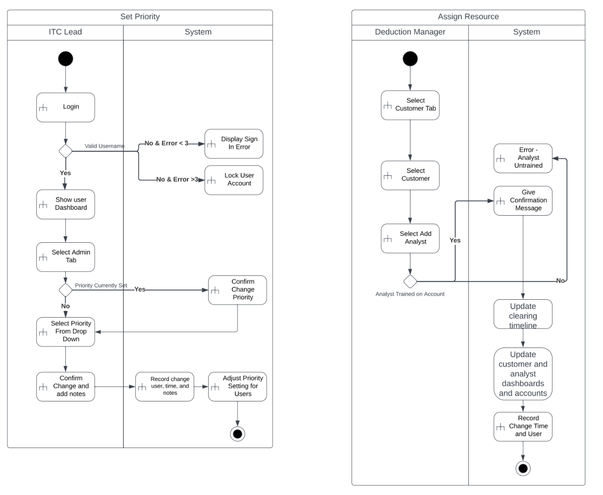

### Activity Diagram

The activity diagram is used in the requirements gathering process to help us build our understanding of how the system should work. Each item in the diagram represents a specific action the user is taking. You can also observe decision tree and the outcomes of those trees based on the given constraints. 

These activity diagrams were captured early in the project and helped us formulate what we wanted the end system to look like.

