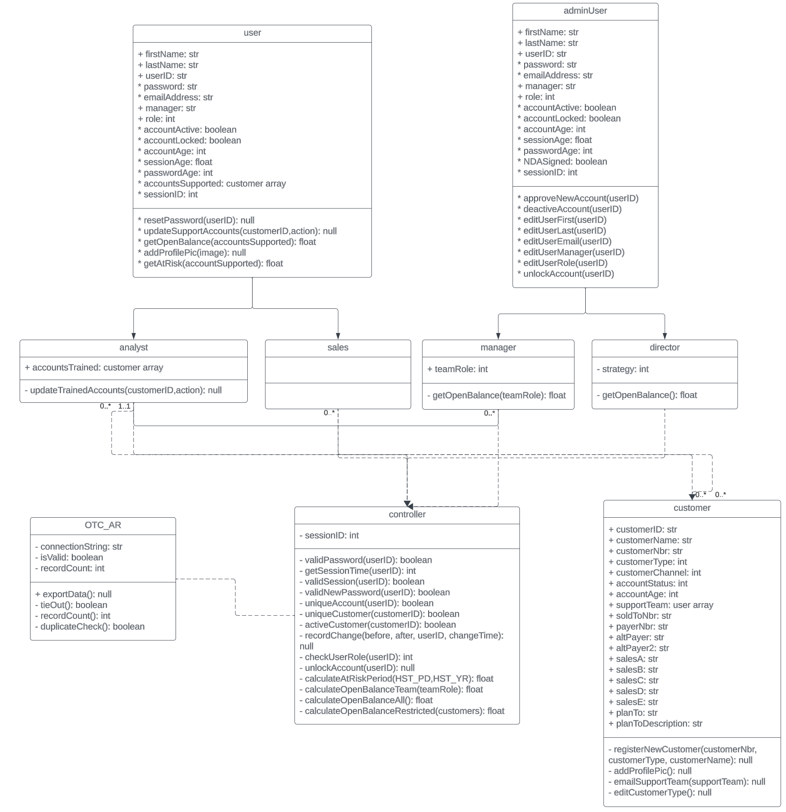
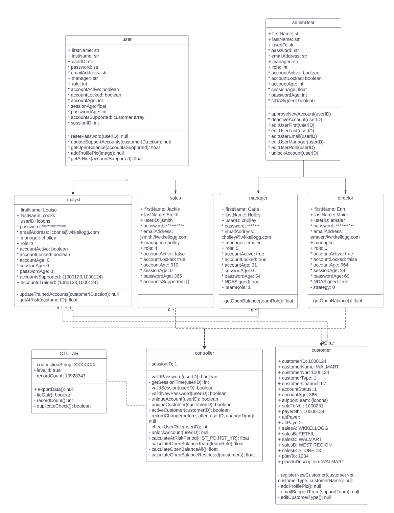

### Class Diagram

The class diagram represents the structure of the system by showing the system classes, attributes, methods, and the relationships between the classes. 

The primary components of a class diagram include: 

**Classes**

Each block in the diagram represents an invidual class. A class is a blueprint for the objects, defining their attributes and behaviors. 

**Attributes**

An attribute is a property of the class. These are listed in the middle section of each class block and tells you what the name of the attribute is and what data type it can store. 

**Methods**

Methods are the actions or behaviors that a class can perform. These are listed at the bottom of the class block. Each method will give you the name, parameters, and a return type. 

**Multiplicity**

The multiplicy is the number of instances of one class related to the number of instances in another class. For example, the user.analyst class can only have 1 manager, wheres the manager class can have 0 to many users reporting to them. 

**Dependnacy**

Dependancy is a relationship between two classes where when changes in one class may affect another class. This is indicated by a dashed line with an arror point from the dependent class to the independant class. 

### Object Diagram

An object diagram is a structureal diagram similar in nature to the class diagram. This diagram provides a snapshot of the system at a particular time, showing the object that are created and the relationships between them. 

