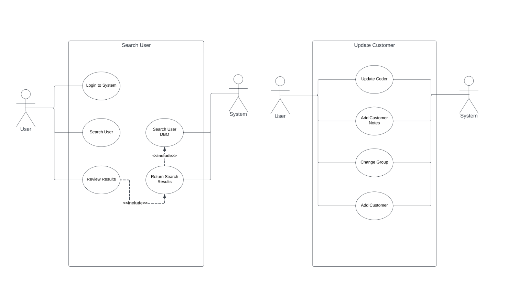

### Use Case Diagram

The Use Case Diagram is a UML tool designed to help us understand the needs of the system users to ensure that we are capturing the full scope of the necessary requirements. 

These use case diagrams were captured early in the project and helped us formulate what we wanted the end system to look like.

